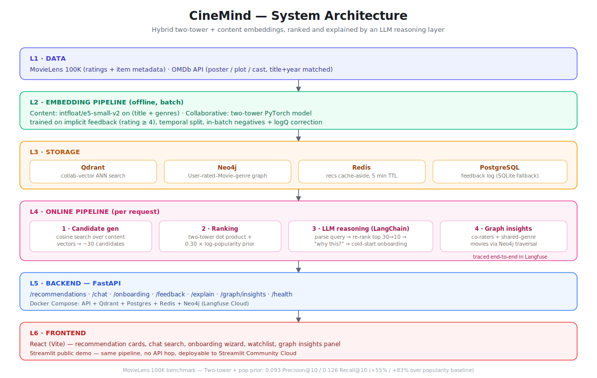

# CineMind

**An LLM-Augmented Hybrid Deep Learning Framework for Personalised, Explainable, and Conversational Movie & Show Recommendation**


CineMind is a full-stack movie/TV recommendation system that combines a
PyTorch two-tower deep learning model (collaborative filtering) with an LLM
reasoning layer (Claude API or Groq, via LangChain) to deliver personalised,
explainable, and conversational recommendations. It solves three real
problems: real-time personalisation for returning users, cold-start
resolution for new users via an onboarding chat, and transparent
"Why this?" explanations.

Benchmarked against an RBM baseline (reference:
[nshakhapur/Movie_Recommendation_DeepLearning](https://github.com/nshakhapur/Movie_Recommendation_DeepLearning))
on MovieLens 100K:

| Model | Precision@10 | Recall@10 |
|-------|-------------|-----------|
| Popularity baseline | 0.061 | 0.066 |
| RBM | 0.075 | 0.082 |
| Two-tower | 0.058 | 0.091 |
| Two-tower + pop prior (hybrid) | **0.093** | **0.126** |

---

## Quickest way to run it (Windows)

A single script sets up everything — Python, Node, Docker, the dataset, the
trained model, the backend stack, and the React frontend — and launches the
app in your browser. From a fresh `git clone`:

```powershell
cd cinemind_phase1
.\setup_and_run.ps1
```

It's safe to re-run: every step is skipped if it's already done (existing
`.venv`, dataset, trained model, `.env`, etc. are left alone), so re-running
after a reboot just starts things back up quickly. See
[`cinemind_phase1/setup_and_run.ps1`](cinemind_phase1/setup_and_run.ps1) for
what each step does, and its flags:

- `-SkipDocker` — frontend + degraded backend only (numpy/SQLite fallback,
  no Docker required at all)
- `-SkipPipeline` — skip the ML training pipeline (assumes artifacts already
  exist)
- `-NoBrowser` — don't auto-open the browser at the end

The first run will interactively prompt for API keys (paste one for Groq
*or* Anthropic, at minimum, to enable chat/explanations — everything else is
optional) and write `cinemind_phase1/.env` for you.

---

## Architecture at a glance



Full details, verified build status, and every design decision are documented in
[`cinemind_phase1/CLAUDE.md`](cinemind_phase1/CLAUDE.md). Interactive versions of
this diagram (plus a project-phase status board and a request-level data-flow
diagram) live in
[`cinemind_phase1/System Architecture/`](cinemind_phase1/System%20Architecture).

## Project layout

```
cinemind_phase1/
  setup_and_run.ps1     # automated setup + launch script (see above)
  src/                  # Phase 1: data prep, RBM baseline, two-tower model, evaluation
  backend/              # Phase 2: FastAPI app + Docker Compose stack
  frontend/             # Phase 3: React (Vite) app
  streamlit_app/        # Phase 3.5: Streamlit public demo
  notebooks/            # Jupyter mirrors of the Phase 1 scripts
  README.md             # Phase 1-scoped quick start (manual, step-by-step)
  SETUP_GUIDE.md         # full manual walkthrough
render.yaml              # Render deploy config for the FastAPI backend
```

## Manual setup

If you'd rather run each step yourself instead of the automated script, see
[`cinemind_phase1/README.md`](cinemind_phase1/README.md) for the manual
quick-start and [`cinemind_phase1/SETUP_GUIDE.md`](cinemind_phase1/SETUP_GUIDE.md)
for the full walkthrough (data download, environment variables, Docker,
deploying to Render/Vercel/Streamlit Cloud).

## Tech stack

| Layer | Tools |
|---|---|
| Modeling | PyTorch (two-tower), `intfloat/e5-small-v2` content embeddings |
| Storage | Qdrant (vectors) · Neo4j (graph) · Redis (cache) · PostgreSQL (feedback) |
| LLM reasoning | Claude API or Groq, orchestrated with LangChain, traced with Langfuse |
| Backend | FastAPI, Docker Compose |
| Frontend | React (Vite) · Streamlit (public demo) |

## Screenshots

Not yet committed — see [`cinemind_phase1/frontend`](cinemind_phase1/frontend)
to run the React UI locally (`setup_and_run.ps1` handles this for you), or
[`cinemind_phase1/streamlit_app`](cinemind_phase1/streamlit_app) for the
public-demo version. Contributions of real UI screenshots welcome.
